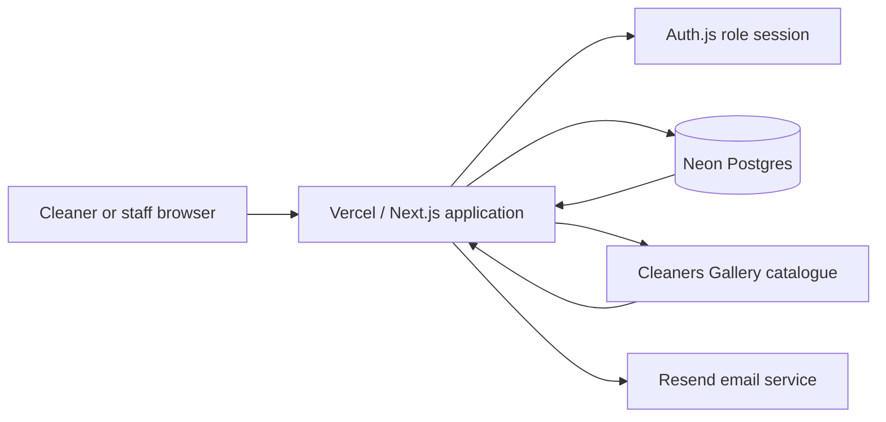

# SupplyHub — Project Documentation

## Document information

| Item | Details |
| --- | --- |
| Project | SupplyHub — Supply Ordering |
| Purpose | Supply request management for field cleaners and operations staff |
| Production | [supply-ordering-jade.vercel.app](https://supply-ordering-jade.vercel.app) |
| Source catalogue | [cleanersgallery.com.au](https://cleanersgallery.com.au) |
| Primary specification | [Supply Ordering functional specification](Supply_Ordering.md) |
| Hosting | Vercel with Neon Postgres |
| Currency | Australian dollars (AUD) |

## 1. Executive summary

SupplyHub replaces an informal supply-request process with one clear workflow.
Approved cleaners can find supplies, choose a product variation, build a cart,
and submit an order request. Operations staff receive the request, arrange
payment outside the application, and update its fulfilment status.

The product catalogue is synchronised from Cleaners Gallery. Product names,
variants, categories, descriptions, images, prices, SKUs, unit sizes, and source
links are retained locally for fast browsing. Submitted orders preserve a
snapshot of their product information and prices so later catalogue changes do
not alter historical requests.

The application is designed independently for phone, tablet, and desktop
screens. It includes restrained motion and scroll effects, while respecting the
user's reduced-motion preference.

## 2. Scope

### Included

- Credential-based authentication and role-based access control
- Cleaner catalogue, product details, cart, submission, and order history
- Supply manager and administrator order management
- Manual product creation and editing
- External catalogue refresh and import history
- Product activation/deactivation, price history, and audit records
- Offline-payment messaging and email notification
- Global supply-ordering feature toggle
- Responsive phone, tablet, and desktop layouts
- Automated unit, integration, and browser testing
- Vercel and Neon production deployment

### Intentionally excluded

- In-app payment
- Automatic purchasing from the external supplier
- Live stock or inventory counts
- Customer ordering
- Recurring or subscription orders
- Full implementations of bookings, customers, jobs, and payouts

The non-supply administrator screens are present as polished placeholders to
show the broader platform structure; their full business logic is outside the
Supply Ordering specification.

## 3. Users and permissions

| Capability | Cleaner | Supply manager | Administrator | Manager | Customer |
| --- | :---: | :---: | :---: | :---: | :---: |
| Browse active products | Yes | Yes | Yes | No | No |
| Manage a cart | Yes | No | No | No | No |
| Submit a request | Yes | No | No | No | No |
| View own requests | Yes | No | No | No | No |
| View all worker requests | No | Yes | Yes | No | No |
| Update status and notes | No | Yes | Yes | No | No |
| View inactive products | No | Yes | Yes | No | No |
| Create or edit products | No | Yes | Yes | No | No |
| Refresh the catalogue | No | Yes | Yes | No | No |
| Access broader admin areas | No | No | Yes | Limited platform context | No |

Supply managers receive a supply-focused navigation. Administrators receive the
same supply tools plus the broader admin shell. Managers and customers cannot
access supply routes, including by entering a protected URL directly.

## 4. Main workflows

### 4.1 Cleaner request flow

1. The cleaner signs in and opens **Supplies**.
2. They search or filter the active catalogue by category.
3. Products with several sizes or variants appear as one product presentation
   with a variation picker; each selected variation remains a separate catalogue
   record underneath.
4. The cleaner chooses a quantity and adds the variation to the cart.
5. They can change quantities, remove items, or continue browsing.
6. Submitting creates a unique order such as `OR-00001` with status
   **Submitted**.
7. The cart is cleared and a confirmation explains that staff will contact the
   cleaner to confirm the request and arrange payment.
8. The cleaner can open the request later to see its locked items, total, and
   public status history.

### 4.2 Fulfilment flow

1. A supply manager or administrator opens **Order requests**.
2. They search by order, worker, or email, then filter or sort the result.
3. The order detail shows worker contact information, frozen line items, total,
   current status, history, and internal notes.
4. Staff select any supported status and may add an internal note.
5. The change is saved as a timestamped order event.

### 4.3 Catalogue refresh

1. An authorised staff member starts a catalogue refresh.
2. SupplyHub fetches the complete Cleaners Gallery Shopify catalogue in bounded,
   retried pages.
3. New variants and initial price history are bulk-created atomically.
4. Changed products are updated and price changes append a history record.
5. Missing synced products are marked inactive rather than deleted.
6. Returning products are updated and reactivated.
7. The outcome is stored in import history. An interrupted or failed refresh
   does not expose a partially updated catalogue.

## 5. Order statuses

| Status | Meaning |
| --- | --- |
| Submitted | Request received and awaiting staff review |
| Contacted | Staff have contacted the cleaner |
| Awaiting payment | Request confirmed and waiting for offline payment |
| Paid | Payment has been received |
| Ordered from supplier | Supplies have been ordered externally |
| Ready for collection | Supplies are ready for pickup |
| Delivered / collected | Request is complete |
| Cancelled | Request will not proceed |
| Issue / on hold | A problem or pause requires attention |

Staff may select any status. Cancelled and Issue / on hold are alternative
outcomes rather than required steps.

## 6. Business and security rules

- Only active products appear to cleaners or can be submitted.
- A disabled cleaner cannot authenticate or submit a request.
- A cleaner can access only their own order data.
- Supply managers and administrators can access all supply requests.
- Cart quantities are constrained from 1 to 999.
- Duplicate cart lines merge into one product-variation line.
- Cart mutation and submission use the same user lock to prevent lost updates.
- Concurrent submissions cannot produce duplicate orders from one cart.
- Product rows are locked while order snapshots are created.
- Submitted names, variants, quantities, and prices are immutable snapshots.
- Products are deactivated rather than deleted.
- Prices are integer cents and display as AUD with two decimal places.
- Internal notes are never shown in the cleaner view.
- Server Actions reload authorisation-sensitive user and feature state from the
  database instead of trusting the browser session alone.
- All protected routes enforce role access on the server.
- Environment files and deployment credentials are excluded from git.

## 7. Responsive interface

| Area | Phone | Tablet | Desktop |
| --- | --- | --- | --- |
| Worker navigation | Compact two-row header | Single-row header | Wide single-row header |
| Admin navigation | Sticky header and dialog menu | Compact icon rail | Full labelled sidebar |
| Catalogue | Two-column touch grid | Three-column grid | Four/five-column grid |
| Product variation | Native select | Pills or select | Pills or select |
| Cart | Compact lines and safe-area sticky submit | Two-column content/summary | Wider content with sticky summary |
| Admin records | Divided mobile lists | Condensed tables | Full data tables |
| Filters | Collapsible native controls | Compact toolbar | Full toolbar and status summary |

Horizontal scrolling is not required for primary navigation or admin status
filters. Interactive controls meet touch-friendly sizing, keyboard focus remains
visible, native form controls retain labels, and motion is disabled when the
operating system requests reduced motion.

## 8. System architecture



### Technology stack

| Layer | Technology |
| --- | --- |
| Application | Next.js 16 App Router and React 19 |
| Language | TypeScript |
| Styling | Tailwind CSS 4 |
| Motion | Motion for React |
| Authentication | Auth.js credentials provider |
| Data access | Prisma ORM 6 |
| Database | PostgreSQL 16 locally; Neon Postgres in production |
| Email | React Email templates and Resend |
| Unit/integration testing | Vitest |
| Browser testing | Playwright |
| Hosting | Vercel |

### Application boundaries

- Server Components perform protected reads and render route-level UI.
- Client Components are used only where browser interaction or animation is
  needed, such as cart controls, variation pickers, menus, and motion.
- Server Actions validate input, reload authorisation state, and perform
  transactional writes.
- Prisma is the only application data-access layer.

## 9. Core data model

| Entity | Responsibility |
| --- | --- |
| User | Identity, role, disabled state, profile, cart, and orders |
| Product | Synced/manual catalogue record and active state |
| PriceHistory | Historical product price points |
| CartItem | One user/product line with quantity |
| Order | Number, owner, status, total, and creation time |
| OrderItem | Frozen product, variant, price, and quantity snapshot |
| OrderEvent | Status transition, actor, timestamp, and optional note |
| ImportRun | Catalogue refresh outcome and counts |
| AuditEvent | Manual product lifecycle audit record |
| Setting | Global feature-toggle state |

## 10. Requirement traceability

| Specification group | Implementation status | Automated evidence |
| --- | --- | --- |
| C-01 to C-10 — Cleaner | Complete | Cleaner and responsive Playwright scenarios; cart/order integration tests |
| SM-01 to SM-11 — Supply manager | Complete | Supply-manager Playwright scenarios; product, status, sync, and email tests |
| A-01 to A-03 — Administrator | Complete | Administrator role and protected-route Playwright scenarios |
| M-01 to M-02 — Manager restrictions | Complete | Role landing and direct-access denial scenarios |
| U-01 — Customer restriction | Complete | Customer role-landing assertion |
| S-01 to S-04 — Catalogue sync | Complete | Shopify mapping unit tests and database sync integration tests |
| Feature toggle | Complete | Navigation, guard, and disabled-state tests |
| Offline payment boundary | Complete | Confirmation and cart/order copy; no payment integration exists |
| Phone/tablet/desktop support | Complete | Dedicated responsive Playwright scenarios and manual visual inspection |

Latest verified baseline:

- ESLint: passing
- TypeScript: passing
- Unit tests: 24 passing
- Database integration tests: 44 passing
- Playwright browser scenarios: 23 passing
- Optimised Next.js production build: passing

## 11. Local development runbook

### Prerequisites

- Node.js 20 or newer
- npm
- Docker Desktop or another Docker-compatible runtime

### Install and run

```bash
git clone https://github.com/Ali2424-meh/supply-ordering.git
cd supply-ordering
npm install
cp .env.example .env
docker compose up -d
npm run db:migrate
npm run db:seed
npm run dev
```

Open [http://localhost:3000](http://localhost:3000).

If port 3000 is already occupied, stop the existing Next.js process or run:

```bash
npm run dev -- --port 3001
```

### Local environment variables

| Variable | Purpose |
| --- | --- |
| `DATABASE_URL` | Local PostgreSQL connection |
| `AUTH_SECRET` | Auth.js signing secret |
| `CATALOGUE_BASE_URL` | External catalogue origin |
| `EMAIL_MODE` | `capture` locally or `resend` in production |
| `TEAM_INBOX` | New-order notification recipient |
| `EMAIL_FROM` | Resend sender identity |
| `RESEND_API_KEY` | Resend API credential |

Generate a local authentication secret with:

```bash
openssl rand -base64 32
```

### Local seed accounts

Local development uses password `password123` for:

- `cleaner@example.com`
- `cleaner2@example.com`
- `disabled@example.com` (intentionally disabled)
- `supply@example.com`
- `admin@example.com`
- `manager@example.com`
- `customer@example.com`

Production uses a separate `SEED_PASSWORD` during the one-off seed operation.
That password must be shared privately and must never be committed to this
document or any repository file.

## 12. Test runbook

```bash
# Static checks
npm run lint
npm run typecheck

# Unit tests
npm test

# Database integration tests
npm run test:int

# Browser tests
npm run test:e2e

# Complete verification
npm run check

# Optimised production build
npm run build
```

Integration and browser tests require the Docker Postgres service. The compose
initialiser creates separate `supply`, `supply_test`, and `supply_e2e` databases
so test resets do not affect development data.

## 13. Deployment runbook

### Vercel environment variables

| Variable | Production value/type |
| --- | --- |
| `DATABASE_URL` | Neon pooled connection URL for application traffic |
| `DATABASE_URL_UNPOOLED` | Neon direct URL for Prisma migrations |
| `AUTH_SECRET` | Strong unique production secret |
| `CATALOGUE_BASE_URL` | `https://cleanersgallery.com.au` |
| `EMAIL_MODE` | `resend` |
| `RESEND_API_KEY` | Sensitive Resend API key |
| `EMAIL_FROM` | Verified sender, or Resend's onboarding sender during testing |
| `TEAM_INBOX` | Address receiving new-order notifications |

The production build runs:

```text
Prisma migrate deploy using DATABASE_URL_UNPOOLED
→ Prisma Client generation
→ Next.js production build
```

Neon's pooled URL remains active for normal server requests. The direct URL is
used only for migrations to avoid pooled advisory locks across deployments.

### Initial database setup

1. Link the Vercel project to Neon.
2. Configure all environment variables.
3. Apply committed migrations.
4. Run the seed once with `VERCEL_ENV=production` and a strong
   `SEED_PASSWORD`.
5. Run the catalogue refresh/import.
6. Deploy production.
7. Smoke-test every role, protected route, product image, cart, and order flow.

### Resend limitation

Resend's onboarding sender can send only to the email address belonging to the
Resend account. To send production notifications to a general operations inbox:

1. Verify a sending domain in Resend.
2. Change `EMAIL_FROM` to an address on that domain.
3. Change `TEAM_INBOX` to the operations inbox.
4. Redeploy so the new environment values are applied.

### Git and Vercel identity

Vercel may block deployments whose commit author is not associated with the
connected GitHub account. This repository is configured to create new commits
as:

```text
Ali Ayco <aycoaliyah2@gmail.com>
```

## 14. Operations guide

### Refresh the catalogue

Open **Product catalogue** as a supply manager or administrator and use the
refresh action. Check **Import history** for counts and any error message.

### Disable supply ordering

An administrator can change the global setting under **Settings**. When
disabled, supply navigation is removed and server guards reject supply actions.
Account maintenance remains available to authorised staff.

### Update an order

Open **Order requests**, select an order, choose a status, optionally add an
internal note, and save. Cleaners see the status progression but never the
internal note.

### Manage a product manually

Supply managers and administrators can create a manual product or edit an
existing record. Activations, deactivations, and important field changes create
audit records. A synced product may be updated again by a later source refresh;
manual-only products are not deactivated by sync.

## 15. Demonstration guide

A concise competition demonstration can follow this sequence:

1. Open the animated sign-in screen on a phone-sized viewport.
2. Sign in as a cleaner and show the dashboard hero, live counts, and request
   journey.
3. Search the catalogue, choose a product variation, and add it to the cart.
4. Show the responsive cart, offline-payment explanation, and submission.
5. Open the new request in cleaner history to show frozen prices and status.
6. Sign in as a supply manager on a tablet-sized viewport.
7. Show the compact admin rail, filters, order detail, status update, and note.
8. Open the catalogue management and import-history screens.
9. Sign in as an administrator on desktop to show the full admin shell and
   feature setting.
10. Briefly show Manager/Customer accounts to demonstrate negative access.

## 16. Maintenance notes

- Prisma is pinned to v6. Do not upgrade to Prisma v7 without migrating the
  datasource and Prisma configuration.
- Do not run `npm audit fix --force`; the current forced resolution proposes an
  incompatible Next.js downgrade. Review upstream dependency updates normally.
- Keep database migrations committed and deploy them before code that depends
  on the new schema.
- Rotate any credential that is accidentally printed, committed, or shared in
  an insecure channel.
- Re-run `npm run check` and `npm run build` after functional changes.
- Re-test phone, tablet, and desktop layouts after shared navigation or table
  changes.
